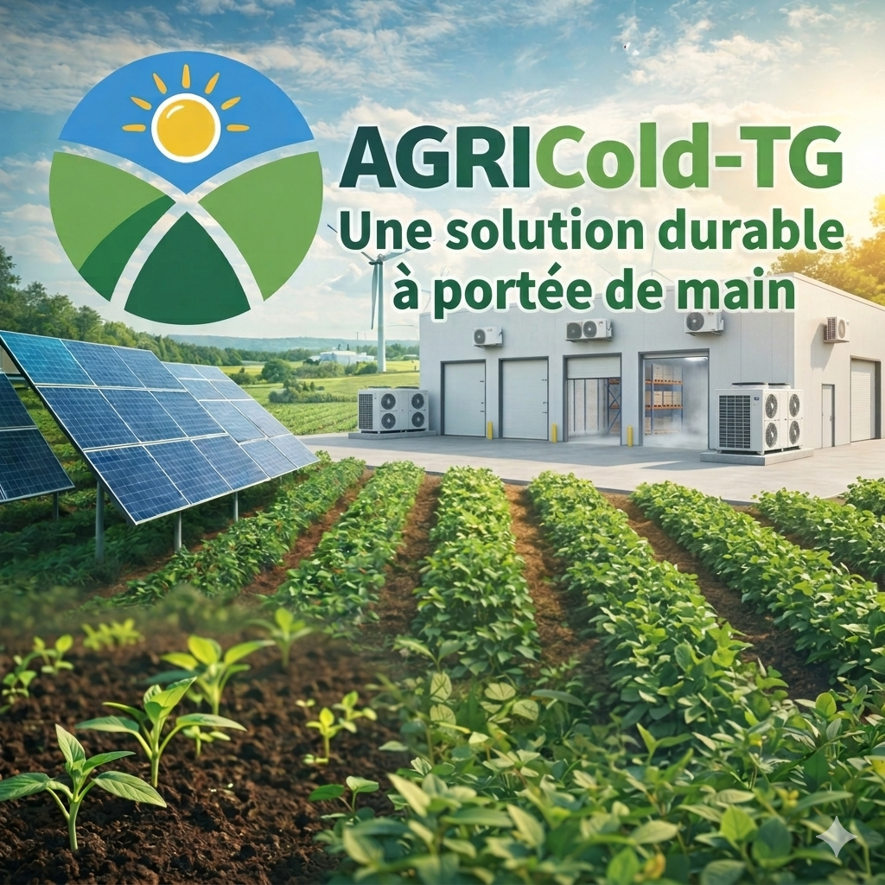

# 🍅❄️ AGRICold-TG : Révolution du Froid Solaire à Broukou

  

**AGRICold-TG** est un système de chambre froide solaire autonome conçu pour éradiquer les pertes post-récoltes de fruits et légumes dans la région de la Kara, au Togo.

## 📍 Pourquoi Broukou ?
Broukou est un pôle stratégique de production maraîchère. Malgré son potentiel, l'absence de chaîne de froid entraîne des pertes massives. Notre solution cible en priorité la **tomate**, produit extrêmement périssable, avant de s'étendre à l'ensemble des fruits et légumes de la zone.

## 🛠️ Spécificités Techniques
- **Énergie** : Alimentation 100% photovoltaïque (adaptée au fort ensoleillement de la Kara).
- **Isolation** : Utilisation de matériaux optimisés pour les hautes températures locales.
- **Polyvalence** : Système de régulation thermique ajustable pour différents types de produits.

## 📅 État d'avancement
- **Semaine 1** : Identification de la cible (Broukou) et diagnostic des pertes.
- **Semaines 2 & 3** : Conception technique et choix des composants.
- **Dernière semaine (En cours)** : Finalisation du prototype et préparation du support de présentation.

---
*Projet développé dans le cadre du Rab'hacks 2026.*

